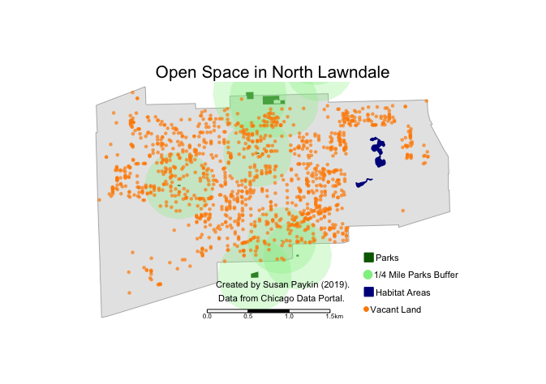
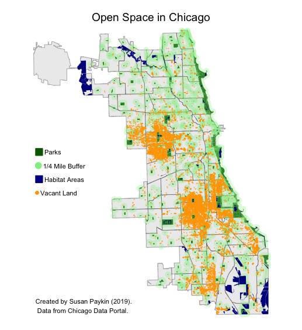
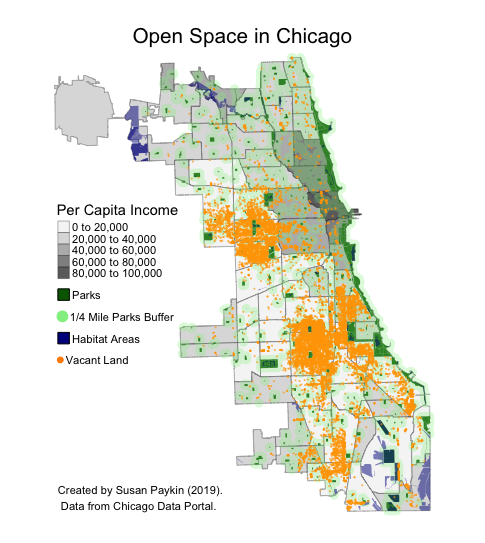
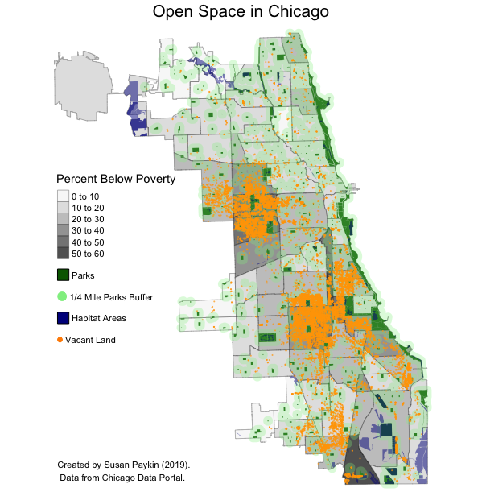

```{r setup, include=FALSE}

knitr::opts_chunk$set(echo = TRUE)

# Load Libraries
library("rgdal")
library("rgeos")
library("sp")
library(tmap)
library(leaflet)
library(raster)
library(adehabitatHR) # Needed for kernel density surface
library(tmaptools)
library(RColorBrewer)
library(usethis)

```

## Introduction
Land use is an important factor in Chicago's urban planning strategy, and access to open space is often used as an indicator of the environmental and economic health of a community. While green areas like parks and wildlife habitats are usually considered "good" open spaces, there is another type of open space that is more often considered "bad" or undesireable: vacant property. 

I explore the spatial patterns of vacant land and green spaces in North Lawndale, a low-income community area on Chicago's West Side. North Lawndale and other West Side communities face a broad range of challenges, such as high crime and high poverty rates. I decided to focus on North Lawndale because of the high concentration of vacant land I observed in my initial visualizations of the data in Chicago (see *Figures 1-3* below). Due to the high concentration of vacant land, North Lawndale could be a good candidate for targeted policies or programs to address land use and underutilized spaces in the city. Therefore, a market analysis of open space could be helpful to those seeking to better understand and improve accessibility to green spaces in low-income areas. 

**This report helps quantify and visualize the current state of accessibility to open space across six variables**: location and size of public parks, access to public parks (distance), location and size of wildlife habitats, location of city-owned vacant properties, per capita income, and the percentage of households below the poverty line. 

## Methodology
I used data from the Chicago Data Portal and the American Community Survey (Census) for this analysis of open space and poverty in North Lawndale and Chicago. I identified four relevant datasets through the Portal, then looked to the Census for data on income and poverty levels. From the Chicago Data Portal, I downloaded shapefiles of Chicago Community Area Boundaries, which would be the foundation onto which I would map the additional data and subset North Lawndale as my area of interest. Next, I found spatial datasets on different types of open space: 1) [Habitat areas](https://data.cityofchicago.org/Environment-Sustainable-Development/Open-Spaces-Habitats/7ah2-brjg), defined as natural areas that support wildlife; 2) [Chicago Park District park boundaries](https://data.cityofchicago.org/Parks-Recreation/Parks-Chicago-Park-District-Park-Boundaries-curren/ej32-qgdr); and 3) an [inventory of city-owned vacant land](https://data.cityofchicago.org/browse?q=City-Owned%20Land%20Inventory&sortBy=relevance). Finally, I downloaded the ACS 5-Year 2017 Estimates on Select Economic Characteristics dataset to use the data on income and poverty for Chicago.  I used R for all my final maps and analysis, although I performed initial visualizations in both Geoda and QGIS. 

In this analysis, I define *access* as a measure of distance (parks, habitat areas), as well as sum total (vacant properties). The reason behind this distinction is that parks and habitat areas are usually free for people to use and enjoy, but their distance from residents can impact how they are utilized. However, the number of vacant properties is a helpful measure because this count can help predict economic conditions and affects the housing prices of occupied properties in the area. 

## Analysis: North Lawndale

I decided to add **quarter-mile buffers** to the city parks because people tend not to travel far to access parks, instead opting to walk or ride their bikes. I chose this distance as a measure of access because people are typically more likely to visit a park within the vicinity of a quarter-mile from their residence. Accessing city parks is free, so the main barrier to entry to these green areas is this travel distance. I made a **union of the park buffers** to better represent these parks' accessibility, in terms of distance. The city parks and habitat areas are represented in the shapes of their geographical boundaries, as opposed to points, because these spaces vary greatly in shape, total area and acreage. I chose to represent the city-owned vacant properties as points because these sites are smaller in size on average. I also wanted them to stand out among the parks and habitat open spaces. Orange draws attention to these points and contrast with the blue-green palette of the parks, park buffers and habitat areas.



As illustrated in the map above, North Lawndale's open spaces include a high concentration of city-owned vacant properties throughout the area, one cluster of habitat areas, three small parks located within the area boundaries and five parks located on the border of or just beyond of the border of North Woodlawn. I decided to include these "border parks" in my market analysis because they still fell within the quarter-mile park buffer zone for some North Lawndale residents. 

For comparison, I also visualized thee datasets for the entire city of Chicago (see Figure 1 below). Here I observed heterogeneity across all the indicator, particularly in the vacant lands which were **clustered in low-income areas.** For further exploration, I plotted the open space data again, this time overlayed with income per capita data (see Figure 2). Next, for additional perspecitve on the distribution of wealth across the city, I plotted the open space data again, overlayed with data on the percentage of households per community living below the poverty line (Figure 3).

This **chloropleth equal-breaks map** was the most effecetive representation of concentrated high-poverty "hot spot" areas across Chicago, particularly on the South and West Sides. The orange dots representing vacant properties are **clustered around areas that have high percentages of residents below the poverty line.** This suggests that higher levels of poverty could be correlated with more vacant properties. This phenomenon could be due in part to home foreclosures, caused by financial hardships linked to low incomes and high poverty. Although I  observe correlation in this data, further analysis would be necessary to demonstrate a causal relationship.

There is no clear, spatially-dependent pattern of city park locations in West Lawndale, nor Chicago as a whole. While city parks are concentrated along the coast line of Lake Michigan, upon moving West, parks exist in almost every area. However, the size and total area of those parks varies across areas. City parks represent a total of 8,793.6 acres, or 5.8% of the city's total area of 234 square miles (149,760 acres). In comparison, North Lawndale's parks represent a total of 48.91 acres, or just 2.4% of the neighborhood's total area of 3.20 square miles (2048 acres). Furthermore, more than half of the total area of North Lawndale does not fall within the quarter mile buffer zone of park access.

Wildlife habitats are also scarce in North Lawndale. These habitat areas may or may not be accessible to the public, whether visitors are barred to protect wildlife or the areas are inaccessible due to environmental factors. There is only one habitat area located in North Lawndale. The Douglas Park Lagoon encompasses 10 acres, or 0.4% of North Lawndale's total area. In comparison, Chicago has 5637.15 acres of habitat representing 3.7% of the city's total area. This suggests that the average West Lawndale resident's level of access to open green space is much lower compared to the average level of access across the city.







## Conclusion 
The North Lawndale community has limited access to open green space. While vacant properties abound, they are spatially independent within the area, suggesting that blight is widespread. This phenomenon is in stark contrast to vacant properties across the city as a whole, where there is clear spatial dependence between vacant properities and low-income neighborhoods such as North Lawndale. Furthermore, North Lawndale's city parks and habitat areas are below-average in size, and many residents live more than a quarter mile away from these open green spaces. 

One recommendation for addressing these issues would be developing some of North Lawndale's many vacant properties into parks or restored wildlife habitats. With an abundance of unused land, city and local officials could transform North Lawndale by increasing the number of open green spaces. 
